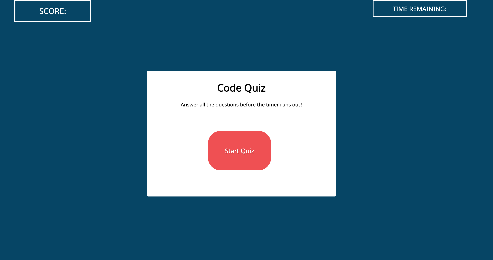
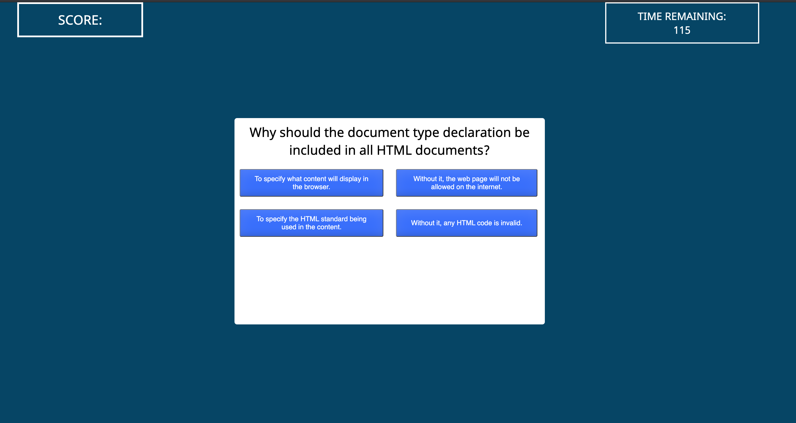
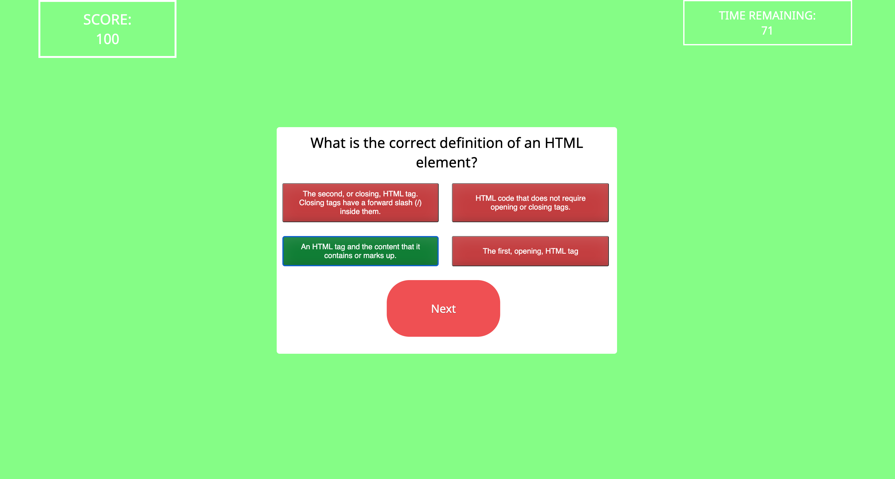
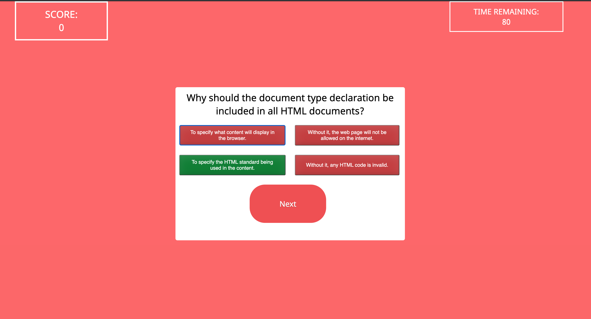
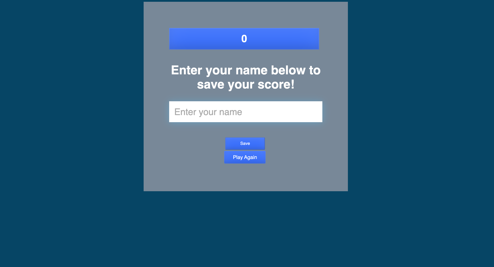

# Code-Quiz

1. [ Process. ](#process)
2. [ Overview. ](#overview)
3. [ Web Address. ](#web-address)
4. [ Usage tips. ](#usage)
5. [ Source Credit. ](#source-credit)
6. [ License. ](#license)

<a name="process"></a>

## 1. Process

I want to point out first and foremost, this has been the most difficult homework I've had to do so far. I felt as if I was not prepared for this level of javascript and found myself searching the web for solutions most of the time. This has been a big realizing to me that I will need to get more practice in!
```
Things I could not add because of time constraint:
- Final score does not show up at the ending screen.
- Submission of initials can not be submitted.
- media query has not been added.
- When time runs out it does not start the quiz over.

```
<a name="overview"></a>

## 2. Overview

```
AS A coding boot camp student
I WANT to take a timed quiz on JavaScript fundamentals that stores high scores
SO THAT I can gauge my progress compared to my peers
```


### This is Takuya Matsumoto's Code Quiz

Desktop Screen Before Starting Quiz:



Desktop Screen After Clicking Start:


When You Get Question Right:


When You Get Question Wrong:
)

Ending Screen:



<a name="web-address"></a>

## 3. Site Links

[github pages site] https://takuyamats.github.io/Code-Quiz/

[github repository site] https://github.com/TakuyaMats/Code-Quiz.git

<a name="usage"></a>

## 4. Usage Tips

```
GIVEN I am taking a code quiz
WHEN I click the start button
THEN a timer starts and I am presented with a question
WHEN I answer a question
THEN I am presented with another question
WHEN I answer a question incorrectly
THEN time is subtracted from the clock
WHEN all questions are answered or the timer reaches 0
THEN the game is over
WHEN the game is over
THEN I can save my initials and my score
```

<a name="source-credit"></a>

## 5. Source Credits:


1. <a href="https://youtu.be/f4fB9Xg2JEY ">Brian Design "Youtube"</a> 
2. <a href="https://youtu.be/riDzcEQbX6k">Web Dev Simplified "Youtube"</a>
3. <a href="https://fdossena.com/?p=html5cool/buttons/i.frag">Federico Dossena "Cool and Responsive Buttons"</a>


<a name="license"></a>

## 6. License

MIT License

Copyright (c) [2021] [Takuya Matsumoto]

Permission is hereby granted, free of charge, to any person obtaining a copy of this software and associated documentation files (the "Software"), to deal in the Software without restriction, including without limitation the rights to use, copy, modify, merge, publish, distribute, sublicense, and/or sell copies of the Software, and to permit persons to whom the Software is furnished to do so, subject to the following conditions:

The above copyright notice and this permission notice shall be included in all copies or substantial portions of the Software.

THE SOFTWARE IS PROVIDED "AS IS", WITHOUT WARRANTY OF ANY KIND, EXPRESS OR IMPLIED, INCLUDING BUT NOT LIMITED TO THE WARRANTIES OF MERCHANTABILITY, FITNESS FOR A PARTICULAR PURPOSE AND NONINFRINGEMENT. IN NO EVENT SHALL THE AUTHORS OR COPYRIGHT HOLDERS BE LIABLE FOR ANY CLAIM, DAMAGES OR OTHER LIABILITY, WHETHER IN AN ACTION OF CONTRACT, TORT OR OTHERWISE, ARISING FROM, OUT OF OR IN CONNECTION WITH THE SOFTWARE OR THE USE OR OTHER DEALINGS IN THE SOFTWARE.